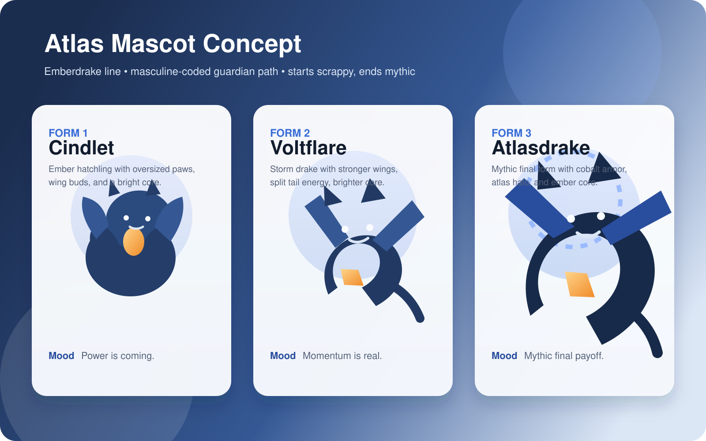
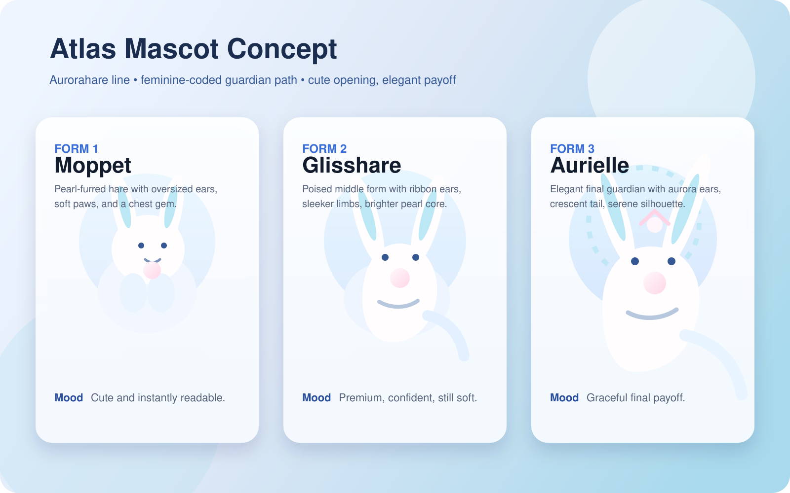

# Atlas Mascot Evolution Concept

Grounded in the actual Atlas repo on April 11, 2026.

This concept is based on the current native iOS architecture and product guardrails already in the repo:

- rewards already exist as a deterministic, local-first point and level system in [atlas-ios/Packages/AtlasDomain/Sources/AtlasDomain/AtlasRewards.swift](../../atlas-ios/Packages/AtlasDomain/Sources/AtlasDomain/AtlasRewards.swift)
- the Today and Insights surfaces already render rewards and an optional companion layer in [atlas-ios/Packages/AtlasFeatures/Sources/AtlasFeatures/AtlasRewardsFeatures.swift](../../atlas-ios/Packages/AtlasFeatures/Sources/AtlasFeatures/AtlasRewardsFeatures.swift) and [atlas-ios/Packages/AtlasFeatures/Sources/AtlasFeatures/AtlasRetentionFeatures.swift](../../atlas-ios/Packages/AtlasFeatures/Sources/AtlasFeatures/AtlasRetentionFeatures.swift)
- the persistence layer already computes a restrained companion snapshot in [atlas-ios/Packages/AtlasPersistence/Sources/AtlasPersistence/AtlasRetentionRepository.swift](../../atlas-ios/Packages/AtlasPersistence/Sources/AtlasPersistence/AtlasRetentionRepository.swift)
- repo guardrails already call for a subtle, premium, optional, non-punitive retention tone in [docs/backlog-execution-handoff.md](../backlog-execution-handoff.md)

## Product Thesis

Atlas should not copy the "keep your pet alive or feel bad" mechanic from more aggressive habit apps.

The better Atlas version is:

- a companion that reflects earned progress instead of demanding attention
- a growth arc powered by the rewards system the app already has
- a calm visual layer that makes discipline feel tangible
- optional from onboarding and always easy to hide

The mascot should feel like a guardian evolving with the user, not a needy Tamagotchi.

## What Other Apps Teach Us

### Good patterns to borrow

- Finch makes the creature feel emotionally supportive and ties progress to completed goals, adventures, customization, and gentle streaks.
- Pokemon Sleep gives users something fun to look forward to after a healthy behavior instead of punishing them during the behavior.
- Forest makes focus visible instantly through a growing object and a simple "stay in the session" rule.

### Patterns Atlas should avoid

- hard "death" or decay states
- shaming copy after missed days
- too much randomness in how growth happens
- making the mascot louder than the core protocol/productivity experience

## Atlas-Specific Recommendation

Use the mascot as a skin over the existing rewards and continuity systems.

### Core rule set

- `AtlasRewardsSnapshot.totalPoints` stays the primary XP source.
- `AtlasRewardsSnapshot.level` stays the base progression ladder.
- `AtlasRetentionSnapshot` influences mood, posture, and copy, not evolution.
- no hunger meter, no death state, no loss of forms once earned
- inactivity changes the mascot to a resting pose, never a punished state

### Evolution gates

Recommended starting thresholds using the existing 250-point level curve:

1. Form 1: level 1-3
2. Form 2: unlock at level 4 plus at least 1 earned badge
3. Form 3: unlock at level 9 plus at least 3 earned badges and at least 1 currently met goal

Why this fits Atlas:

- the first evolution arrives early enough to feel exciting
- the second evolution requires real consistency, not one lucky week
- the gates are deterministic and already computable from existing snapshots

## How To Integrate It Into Atlas

### 1. Onboarding

Add a new optional step after profile basics:

- title: `Choose your Atlas companion`
- choices:
  - `Emberdrake line`
  - `Aurorahare line`
  - `Skip for now`

Because the onboarding draft already stores an optional `gender`, Atlas can preselect a line that matches your intended male/female default. But the user should always be allowed to switch. That avoids turning the feature into a hard binary lock while still supporting your original product instinct.

### 2. Today tab

Replace the current abstract reward header with a compact mascot card inside the existing Rewards section.

Suggested content:

- mascot portrait
- current form name
- `Level X`
- current XP toward next level
- short calm caption driven by continuity state
- one concrete "next growth" target such as `1 workout left this week` or `2 of 3 goals checked`

This keeps the mascot connected to action instead of becoming decorative clutter.

### 3. Insights tab

Add a dedicated `Companion journey` panel under rewards.

Suggested content:

- three-form evolution road
- unlocked badges mapped to body details or aura accents
- recent growth drivers:
  - activity streak
  - workout goal progress
  - self-defined goal progress
  - weight milestone status
- a short "what feeds growth" explainer

This is where the system can get deeper without making Today noisy.

### 4. Settings

Extend the current rewards / continuity settings with:

- `Show companion`
- `Companion style`
- `Nickname`
- `Show evolution celebrations`

Keep the existing "optional, local, easy to hide" philosophy.

### 5. Notifications and widgets later

Do not start here.

Phase 1 should stay in-app only. If the mascot works, then add:

- widget portrait state
- evolution celebration sheet
- restrained milestone notifications
- tiny pixel mini-sprites for widget and celebration states

## Proposed Mascot Lines

These are working concept names, not final production names.

### Line A: Aetherion line

Default fit for the male-targeted path you described.

Inspirations:

- Charizard-style payoff: starts scrappy, ends iconic and powerful
- Zekrom-style silhouette logic: angular wings, energy core, mythic presence

Personality:

- disciplined
- rising power
- earned dominance
- less cute, more aspirational

Forms:

1. `Cindlet`
   Small ember hatchling. Oversized paws, wing buds, bright chest core. Feels weak now but obviously built for more.
2. `Voltflare`
   Adolescent storm drake. Leaner body, stronger stance, split tail, brighter markings.
3. `Aetherion`
   Final guardian form. Full wing span, atlas-ring halo behind the horns, cobalt-black armor plates, electric ember core.

Production note:

- the approved master visual direction for this line is the third portrait/refinement pass generated from the GPT-image workflow
- future sticker and pixel assets should simplify that exact direction rather than reinterpret it

See concept art:

### Line B: Aurorahare

Default fit for the female-targeted path you described.

Inspirations:

- Eevee-style readability and charm
- Piplup-style proud posture and clean shape language
- Buneary-style long-ear silhouette and bounce

Personality:

- cute without being childish
- elegant, bright, resilient
- soft early form with a graceful premium final evolution

Forms:

1. `Moppet`
   Tiny pearl-furred hare with oversized ears, heartline face markings, and a little chest gem.
2. `Glisshare`
   More poised middle form with ribbon ears, a fuller tail, and sleeker limbs.
3. `Aurielle`
   Elegant final guardian with long aurora ears, crescent tail, pearl crown marks, and a serene high-status silhouette.

See concept art:

## Why This Fits Atlas Better Than A Standard Pet Loop

- Atlas already rewards consistency; the mascot can visualize progress without inventing a second economy.
- Atlas already has companion and retention architecture; this feature can extend that rather than bypass it.
- Atlas's brand is premium and privacy-first; a guardian companion can feel aspirational instead of toy-like.
- The system stays deterministic, local-first, and reviewable.

## Suggested Build Phases

### Phase 1

- add companion selection to onboarding and settings
- create persistent mascot profile and chosen line
- derive form from existing rewards snapshot
- render mascot card in Today and Insights

### Phase 2

- evolution celebration modal
- nickname support
- alternate poses based on continuity mood
- form-specific background treatments

### Phase 3

- widget support
- lightweight collectibles tied to badges
- tiny pixel minis as a required secondary asset set for widgets and celebrations
- seasonal skins only if they can stay tasteful and optional

## Implementation Notes For The Existing Codebase

The cleanest first pass is:

- add a new domain type such as `AtlasCompanionProfile` and `AtlasCompanionSnapshot`
- compute it in persistence using `AtlasRewardsSnapshot` plus `AtlasRetentionSnapshot`
- render it from the existing Today and Insights sections
- keep mascot-specific art assets isolated from the abstract retention model so the current calm continuity logic remains reusable

Likely touch points:

- `atlas-ios/Packages/AtlasDomain/Sources/AtlasDomain/AtlasRetention.swift`
- `atlas-ios/Packages/AtlasDomain/Sources/AtlasDomain/AtlasRewards.swift`
- `atlas-ios/Packages/AtlasPersistence/Sources/AtlasPersistence/AtlasRetentionRepository.swift`
- `atlas-ios/Packages/AtlasPersistence/Sources/AtlasPersistence/AtlasRewardsRepository.swift`
- `atlas-ios/Packages/AtlasFeatures/Sources/AtlasFeatures/AtlasRewardsFeatures.swift`
- `atlas-ios/Packages/AtlasFeatures/Sources/AtlasFeatures/AtlasRetentionFeatures.swift`
- onboarding flow in `atlas-ios/Packages/AtlasFeatures/Sources/AtlasFeatures/AtlasOnboardingFeatures.swift`

## Reference Links

- Finch new user guide: https://help.finchcare.com/hc/en-us/articles/42149821015693-New-User-Guide
- Forest official site: https://forestapp.cc/
- Pokemon Sleep official site: https://www.pokemonsleep.net/en/
- Pokemon Pokedex reference pages:
  - https://www.pokemon.com/us/pokedex/charizard
  - https://www.pokemon.com/us/pokedex/zekrom
  - https://www.pokemon.com/us/pokedex/eevee
  - https://www.pokemon.com/us/pokedex/piplup
  - https://www.pokemon.com/us/pokedex/buneary
